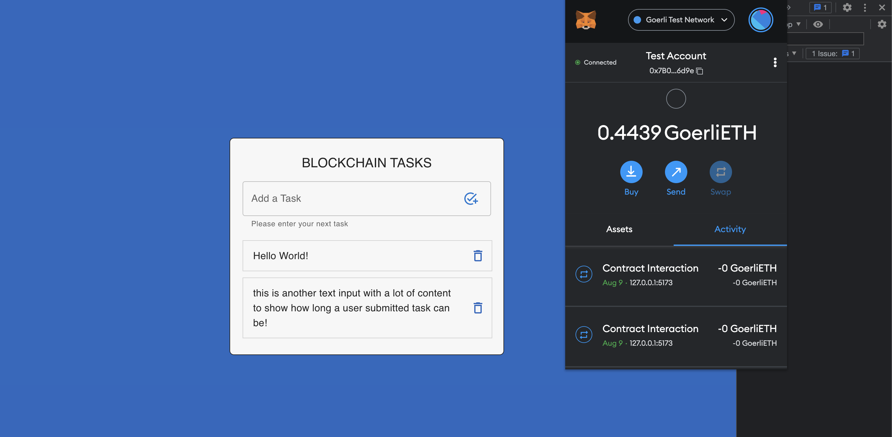

<!-- README LOGO -->
<br />
<p align="center">
  <a href="">
    
  </a>

  <h1 align="center">BlockchainTasks.com</h1>

  <p align="center">
    A minimal blockchain todo dapp using Hardhat, Ethers and OpenZeppelin!<br />
    <a href=""><strong>Explore the docs »</strong></a><br /><br />
    <a href="https://blockchaintasks.com">View Demo</a> · <a href="">Report Bug</a> · <a href="">Request Feature</a>
  </p>

  <p align="center">
    <a href="">   
      
    </a>
  </p>

## Table of Contents
- [About the Dapp](#about-the-dapp)
- [Getting Started](#getting-started)
  - [Prerequisites](#prerequisites)
  - [Installation](#installation)
- [Running Hardhat](#running-hardhat)
- [Contributing](#contributing)

## About The Dapp
A simple Dapp using blockchain development tools such as Hardhat and Ethers.js

Technologies used to scaffold this template:

- [React v18.2.0](https://reactjs.org/versions/)
- [Vite v3.0.0](https://vitejs.dev/)
- [MUI v5.9.3](https://mui.com/versions/)
- [Ethers v5.6.9](https://docs.ethers.io/v5/)
- [OpenZeppelin v4.7.2](https://www.openzeppelin.com/)
- [Chai v4.3.6](https://www.chaijs.com/)

## Getting Started
To get a local copy up and running follow these steps.

### Prerequisites
Requires Node.js version 16 or later. To learn more about which versions of Node.js are supported go to https://hardhat.org/nodejs-versions


### Installation
1. Clone the repo

```
git clone https://github.com/craigwheeler/blockchaintasks.git
```

2. Install NPM packages

```
npm i
```

3. Start

```
npm run dev
```

### Running Hardhat
This project demonstrates a basic Hardhat use case. It comes with a simple contract, a test, and a script that deploys the contract.

```
npx hardhat help
npx hardhat test
GAS_REPORT=true npx hardhat test
npx hardhat node
npx hardhat run scripts/deploy.js
```
## Contributing
Any contributions you make are **greatly appreciated**.

1. Fork the template
2. Create your feature branch (`git checkout -b feature/awesome_feature`)
3. Commit your changes (`git commit -m 'add some awesome_feature'`)
4. Push to the branch (`git push origin feature/awesome_feature`)
5. Open a pull request